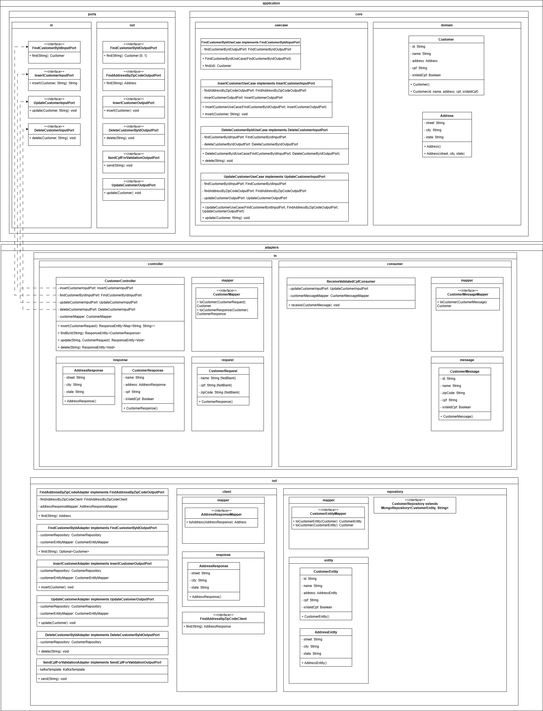

# Projeto: Estudo de Arquitetura Hexagonal com Java

O objetivo deste projeto é **estudar a arquitetura hexagonal (ports and adapters)**, entendendo como isolar a lógica de negócio de dependências externas, como banco de dados, APIs ou mensagerias.  

A aplicação é uma **API REST** que realiza um **CRUD de clientes** (`POST`, `PUT`, `GET`, `DELETE`) e, durante o cadastro, consulta uma **API fictícia (WireMock)** para buscar o endereço com base no CEP informado.  

Após o cadastro, o cliente é **enviado para um tópico Kafka** com o intuito de validar o CPF.  
Atualmente, **não há um consumidor** desse tópico, a mensagem apenas é publicada.

O foco principal **não é a integração com Kafka ou APIs externas**, mas sim a **organização da aplicação seguindo os princípios da arquitetura hexagonal**.

---

## Tecnologias utilizadas

- **Java 17+**
- **Spring Boot**
- **MongoDB**
- **Docker**
- **WireMock** (para simular a API de endereços)

---

## Estrutura geral

O projeto segue a separação entre **camadas internas (core)** e **adapters externos**, conforme a arquitetura hexagonal:

- **Core (Application e Domain)**: contém toda a lógica de negócio, casos de uso e entidades do domínio.  
- **Adapters (in/out)**: implementam as portas de entrada (controllers) e de saída (acessos a banco, APIs, mensagerias etc.).  
- **Ports**: definem contratos para entrada e saída, permitindo que o core não dependa de implementações concretas.

---

## Executando o projeto localmente

### Pré-requisitos

- Docker instalado
- WireMock (arquivo `wiremock.jar` disponível localmente)
- Java 17+ instalado

---

### Passo 0: Configurar variáveis de ambiente

Antes de subir os containers, crie um arquivo chamado `.env` dentro da pasta `docker-local`

Esse arquivo deve conter as credenciais que o container do MongoDB usará:

```bash
MONGO_USER=seu_usuario
MONGO_PASS=sua_senha
```

Essas variáveis serão lidas automaticamente pelo Docker Compose durante a inicialização dos containers.

---

### Passo 1: Subir os containers

Dentro da pasta `docker-local`, execute:

```bash
docker compose up -d
```

Isso irá iniciar os containers do **MongoDB** e **Kafka**.

---

### Passo 2: Configurar o WireMock

Crie os arquivos JSON de mapeamento dentro da pasta `mappings/`, simulando as respostas da API de endereços.  
Exemplo de estrutura de um arquivo (`address-38400000.json`):

```json
{
  "request": {
    "method": "GET",
    "url": "/addresses/38400000"
  },
  "response": {
    "status": 200,
    "headers": {
      "Content-Type": "application/json"
    },
    "jsonBody": {
      "street": "Rua Hexagonal",
      "city": "Uberlândia",
      "state": "Minas Gerais"
    }
  }
}
```

---

### Passo 3: Iniciar o WireMock

Na raiz onde está o `wiremock.jar`, execute:

```bash
java -jar wiremock.jar --port 8082
```

A aplicação irá consumir essa API fictícia na porta **8082**.

---

### Passo 4: Rodar a aplicação

Após confirmar que:
- O **MongoDB** e o **Kafka** estão rodando,
- O **WireMock** está pronto para responder requisições,

basta iniciar a aplicação normalmente pela sua IDE.

---

### Diagrama UML

O diagrama abaixo mostra de forma resumida a estrutura e os relacionamentos entre as principais camadas e componentes do projeto:

